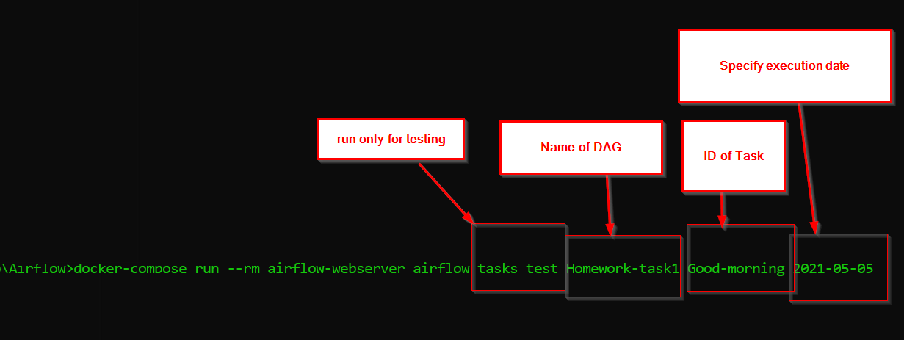

# Download latest yaml
curl -LfO 'https://airflow.apache.org/docs/apache-airflow/2.1.3/docker-compose.yaml'

# Prepare environment
## Linux:
```
mkdir -p ./dags ./logs ./plugins
echo -e "AIRFLOW_UID=\$(id -u)\nAIRFLOW_GID=0" > .env
```

## Windows:
```
mkdir  dags logs plugins <br>
SET  AIRFLOW_UID=50000 <br>
SET AIRFLOW_GID=0
```

# Perform data migration and create user account
docker-compose up airflow-init

# Run Airflow
docker-compose up

# Basic command for individual task testing
docker-compose run --rm airflow-webserver airflow tasks test Homework-task1 Good-morning 2021-05-05



