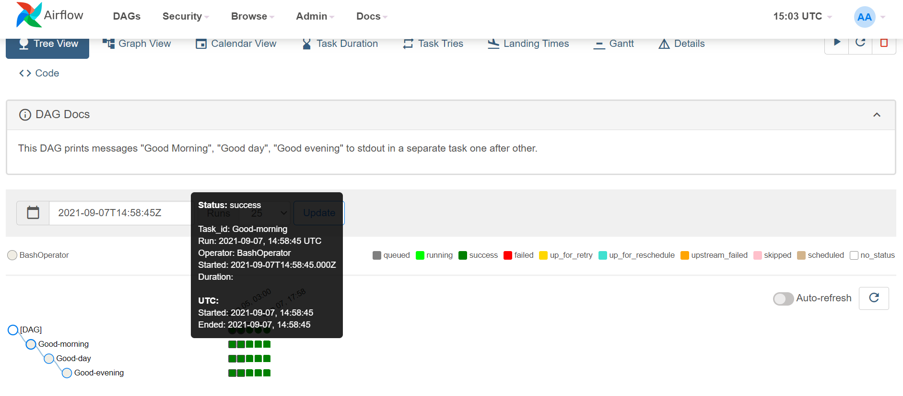
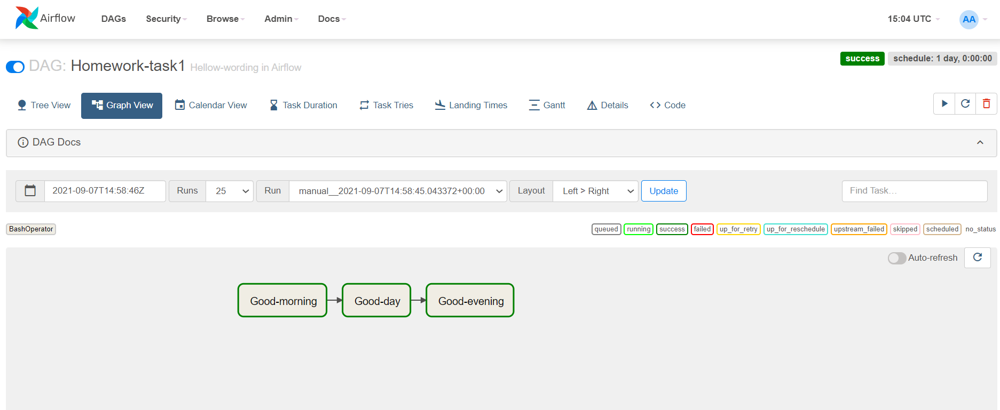
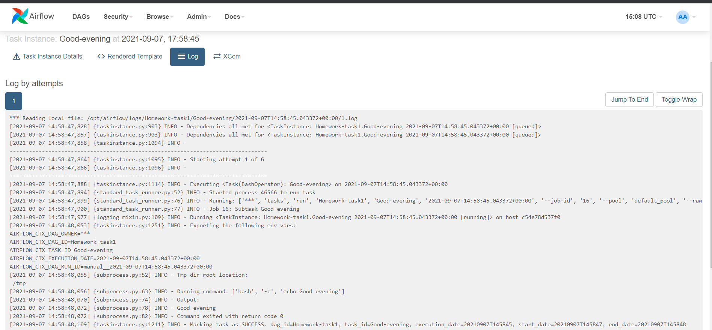
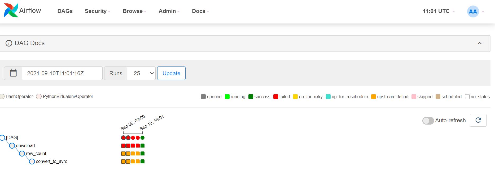
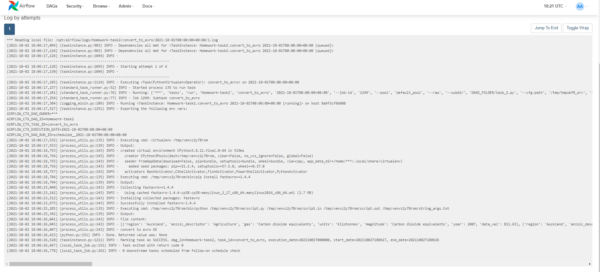
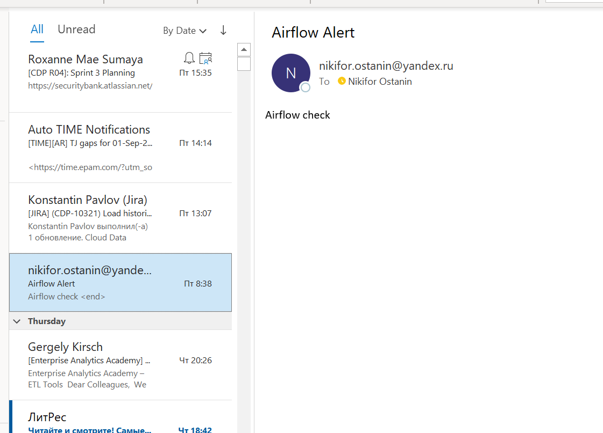

# Task 1
>Create a simple dag that contains printed messages "Good Morning”, "Good day", "Good evening"  
>Each message should be in a separate task.  
>Expected results:  screenshots of tree and graph view.

### Code

[dags/task_1.py](dags/task_1.py)

### Tree

### Graph

### Log

# Task 2

>Create a dag that contains the following tasks:
>1)	Download csv file on your machine:
 https://www.stats.govt.nz/assets/Uploads/Greenhouse-gas-emissions-by-region-industry-and-household/Greenhouse-gas-emissions-by-region-industry-and-household-year-ended-2018/Download-data/greenhouse-gas-emissions-by-region-industry-and-household-year-ended-2018-csv.csv
>2)	Count a number of rows in this file and shows a number
>3)	Convert file in to avro format (you can use script from Overview Module) and save it on your machine  
>Expected results: file with dag’s code and screenshot of log after run.

### Code

[dags/task_2.py](dags/task_2.py)

### Tree

### Log

# Task 3
>Create a dag that contains the following tasks:
>1)	Download csv file on your machine:
https://www.stats.govt.nz/assets/Uploads/Greenhouse-gas-emissions-by-region-industry-and-household/Greenhouse-gas-emissions-by-region-industry-and-household-year-ended-2018/Download-data/greenhouse-gas-emissions-by-region-industry-and-household-year-ended-2018-csv.csv
>2)	Using this data create a create a pivot table. Group the dataset by region and year. As a result a new dataset save in csv.  
Expected results: file with dag’s code and screenshot of log after run, result.csv

### Code

[dags/task_3.py](dags/task_3.py)

### Log

### Result

[data/result.csv](data/result.csv)

# Task 4 *(extra)
Create a sample dag, that sends email.
https://www.astronomer.io/guides/error-notifications-in-airflow  
Expected results: file with dag’s code and screenshot of message

### Code

[dags/task_4.py](dags/task_4.py)

### Comments

_Credentials to connect to SMPT are in airflow.cfg._

_Yandex is not best mail server to do this task - my account was blocked for suspicion of sending spam._

### Log

### Email message

