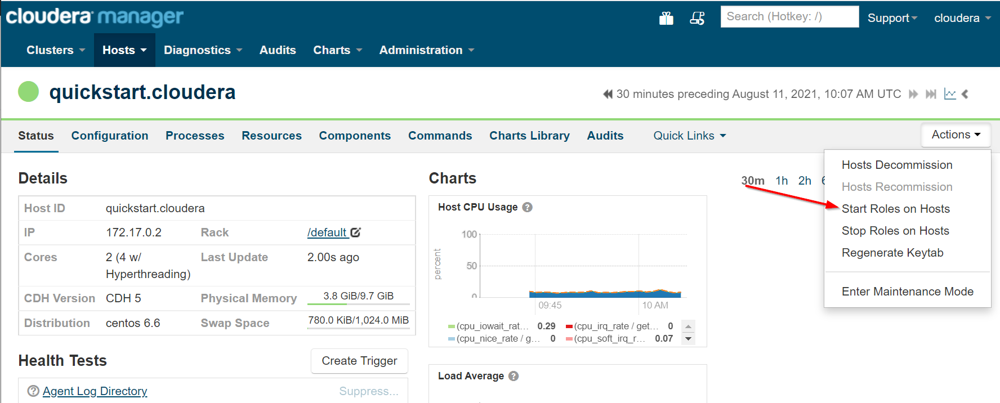
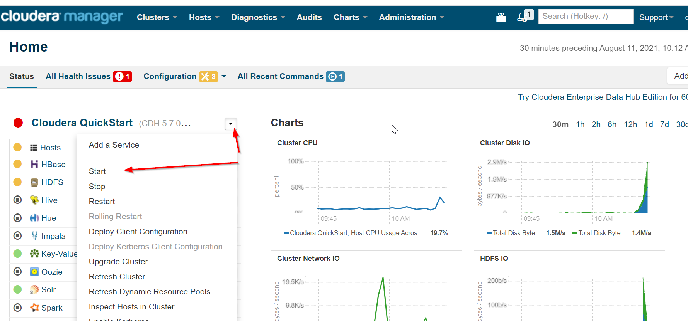

**When run on linux, maximum memory and numbers of GPU migtht be set by arguments**

sudo docker run ```-m 10000m --cpus=4``` --name=cdh_container --hostname=quickstart.cloudera --privileged=true -t -i -v /home/nk/hadoop:/src -p 8888:8888 -p 7180:7180 -p 80:80 -p 9999:50070 -p 8088:8088 cloudera/quickstart /usr/bin/docker-quickstart

**Run Cloudera Manager**
 sudo /home/cloudera/cloudera-manager --express

service cloudera-scm-server restart

**In Cloudera Manager you need manually to start roles**



Or go to main page and press "Start" at cluster menu



**For jupyter-docker it is convenient to attach external folder for get access to data and notebooks (do not forget to make it accessible by docker)**

docker run --name=jupyter_container -it -p 8880:8888 ```-v C:\Users\Nikifor_Ostanin\learn_projects\BigDataLab:/home/jovyan/work``` jupyter/pyspark-notebook 
