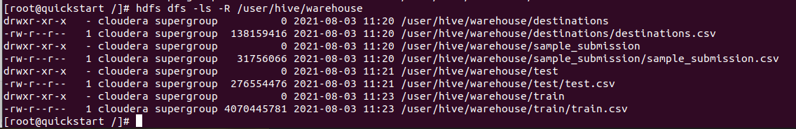
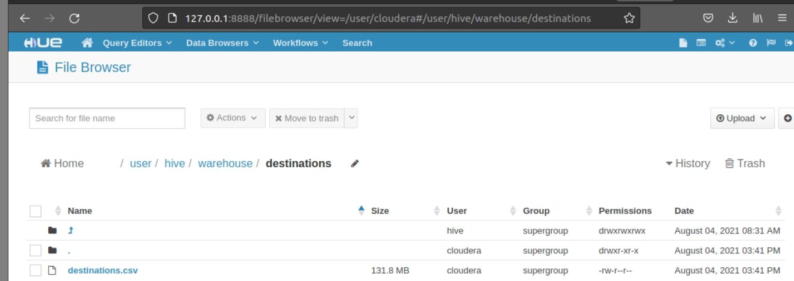

# make dirs at hdfs
```
$ hdfs dfs -mkdir -p /user/hive/warehouse/destinations 
$ hdfs dfs -mkdir -p /user/hive/warehouse/sample_submission
$ hdfs dfs -mkdir -p /user/hive/warehouse/test
$ hdfs dfs -mkdir -p /user/hive/warehouse/train
```


# put files to hdfs 
```
$ cd src
$ hdfs dfs -put -f destinations.csv /user/hive/warehouse/destinations/destinations.csv 
$ hdfs dfs -put -f sample_submission.csv /user/hive/warehouse/sample_submission/sample_submission.csv 
$ dfs dfs -put -f test.csv  /user/hive/warehouse/test/test.csv 
$ hdfs dfs -put  -f train.csv /user/hive/warehouse/train/train.csv
```
# result
```
$hdfs dfs -ls -R /user/hive/warehouse
```


One of folders in HUE UI:

