# Task 1

## 1. External table for struct_cities.json

> 1) CREATE EXTERNAL TABLE (struct_cities.json). 
NOTE: to work with json Hive needs SerDe to be added. Please copy to your external folder (/src/) json-serde-1.3-jar-with-dependencies.jar attached to the lesson materials and command ADD JAR /src/json-serde-1.3-jar-with-dependencies.jar; 
before DDL expression. Required SerDe name is 'org.openx.data.jsonserde.JsonSerDe'

Add JAR for json serialization/deserialization
```
ADD JAR     hdfs:///user/hive/jars/json-serde-1.3-jar-with-dependencies.jar;
```


### Create nested table from json

```
drop table if exists  struct_cities ;
create external table struct_cities 
                                ( 
                                   country_code string
                                 , cities array  
                                            < struct
                                                  < code:string
                                                  , city:string
                                                  , timezone:string
                                                  , available_2017:string
                                                  , available_2016:string
                                                  , available_2015:string
                                                  >
                                            >
                                      
                                ) 
                      row format  SERDE 'org.openx.data.jsonserde.JsonSerDe'
                      location '/user/hive/warehouse/struct_cities';

```
Result table:

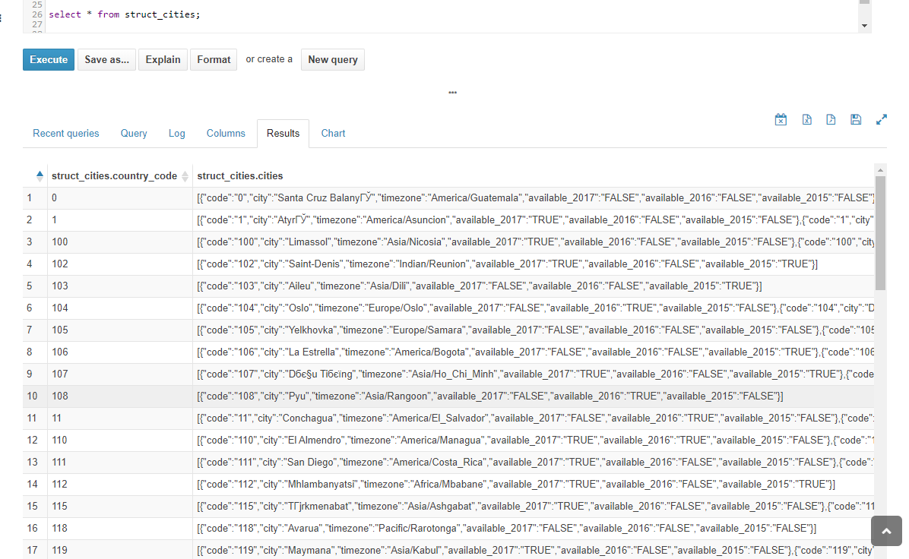


### Query as flat table from nested
```
select   country_code
       , code as cities_code
       , city as cities_city
       , timezone as cities_timezone
       , avalible_2017 as cities_avalible_2017
       , avalible_2016 as cities_avalible_2016
       , avalible_2015 as cities_avalible_2015

      
from struct_cities
lateral view inline(cities) city as code, city, timezone, avalible_2017, avalible_2016, avalible_2015;
```
Job takes ~ 11 seconds:
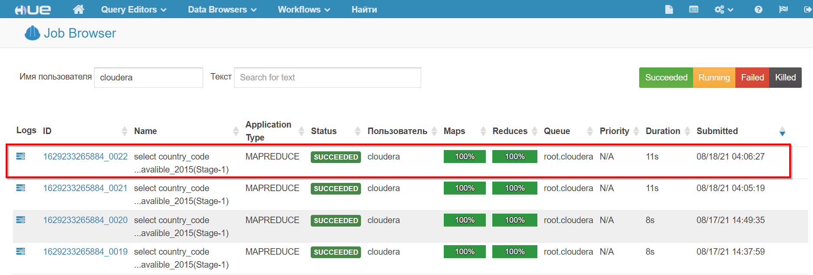

result:
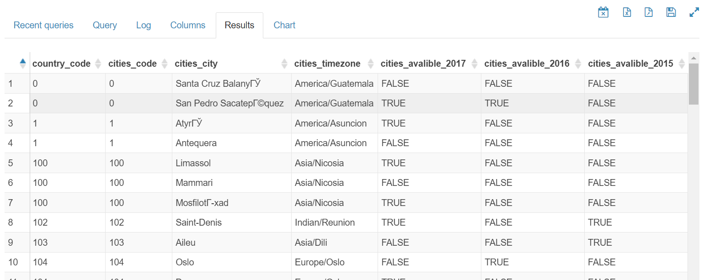


## 2. Load data inpath (test.csv)

> CREATE TABLE + LOAD DATA INPATH OVERWRITE INTO TABLE . Note that Hive consumed the data file *.csv during this step. If you look in the File Browser you will see .csv is no longer there. Copy hive script to archive. (test.csv)

```
create table test 
              ( 
               id int
              ,date_time timestamp
              ,site_name string
              ,posa_continent  int
              ,user_location_country int
              ,user_location_region int
              ,user_location_city int
              ,orig_destination_distance float
              ,user_id int
              ,is_mobile int 
              ,is_package int
              ,channel int 
              ,srch_ci date 
              ,srch_co date
              ,srch_adults_cnt int
              ,srch_children_cnt int 
              ,srch_rm_cnt int
              ,srch_destination_id int
              ,srch_destination_type_id int
              ,hotel_continent int
              ,hotel_country int
              ,hotel_market int
              )
              row format delimited fields terminated by ','
              tblproperties ("skip.header.line.count"="1");
              
              
load data inpath '/user/hive/warehouse/test/test.csv' overwrite
into table test;
```

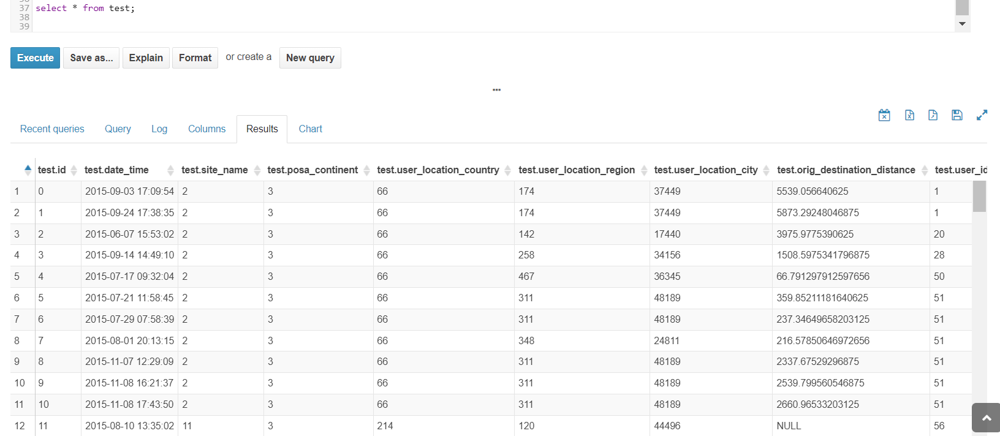

## 3. Clustering train.csv
> 3) CREATE TABLE  CLUSTERED BY (hotel_country) SORTED BY (hotel_country) INTO 32 BUCKETS . (train.csv)


-- 3) CREATE TABLE  CLUSTERED BY (hotel_country) SORTED BY (hotel_country) INTO 32 BUCKETS . (train.csv)

drop table if exists train;

```
create external table train
                        (
                        date_time timestamp
                        ,site_name int
                        ,posa_continent int
                        ,user_location_country int
                        ,user_location_region int
                        ,user_location_city int
                        ,orig_destination_distance float
                        ,user_id int
                        ,is_mobile int
                        ,is_package int
                        ,channel int 
                        ,srch_ci date
                        ,srch_co date
                        ,srch_adults_cnt int
                        ,srch_children_cnt int
                        ,srch_rm_cnt int 
                        ,srch_destination_id int 
                        ,srch_destination_type_id int
                        ,is_booking int
                        ,cnt int
                        ,hotel_continent int
                        ,hotel_country int
                        ,hotel_market int
                        ,hotel_cluster int
                        )
            clustered by (hotel_country) sorted by (hotel_country) into 32 buckets
            row format delimited fields terminated by ','
            location '/user/hive/warehouse/train'
            tblproperties ("skip.header.line.count"="1");
                        
```

Result:

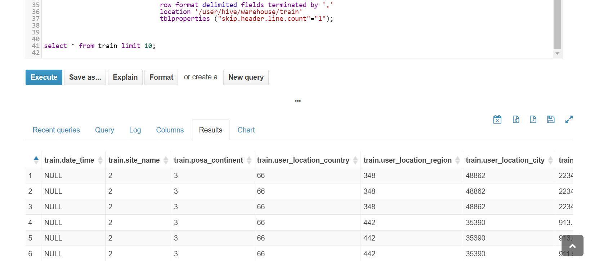


### 4. CTAS
> Using CTAS (Create table as select) create table ‘test_parquet’ stored as parquet from ‘test’ table created in 1.2 The largest table should be created twice: without bucketing and using bucketing • Write hive script to calculate Top 3 most popular countries where booking is successful (booking = 1), make screenshots before and after script execution, copy hive script to archive.

Hive  catch error (code 2) (needs memory/optimization)
Task done in Impala.

Without bucketing:

```
create table test_parquet
stored as parquet
as   
select *  from test;
```

With bucketing:


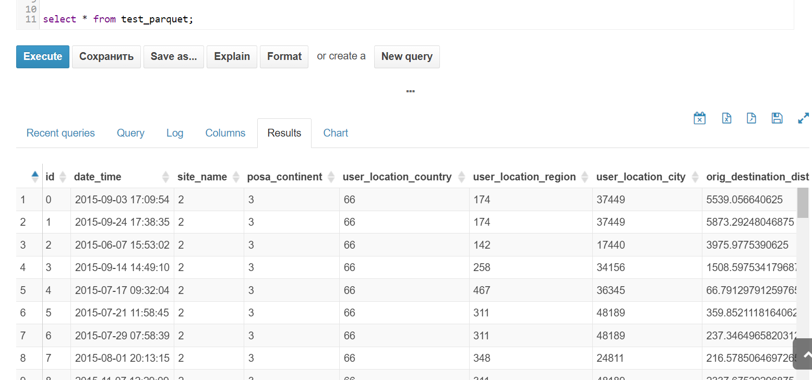 


### 5. Top 3 countries

> Write hive script to calculate Top 3 most popular countries where booking is successful (booking = 1), make screenshots before and after script execution, copy hive script to archive.

Query for Hive (not support ordering by count(*), need subquery ):

```
select * from
  (
   select hotel_country,  count(*) as cnt from train 
   where is_booking = 1
   group by hotel_country
  ) t
order by cnt desc limit 3;
```

Query for Impala (30x faster, suport count(*) in order by clause):
```
select hotel_country,  count(*) as cnt from train 
where is_booking = 1
group by hotel_country
order by count(*) desc limit 3;
```
Result (Hive):

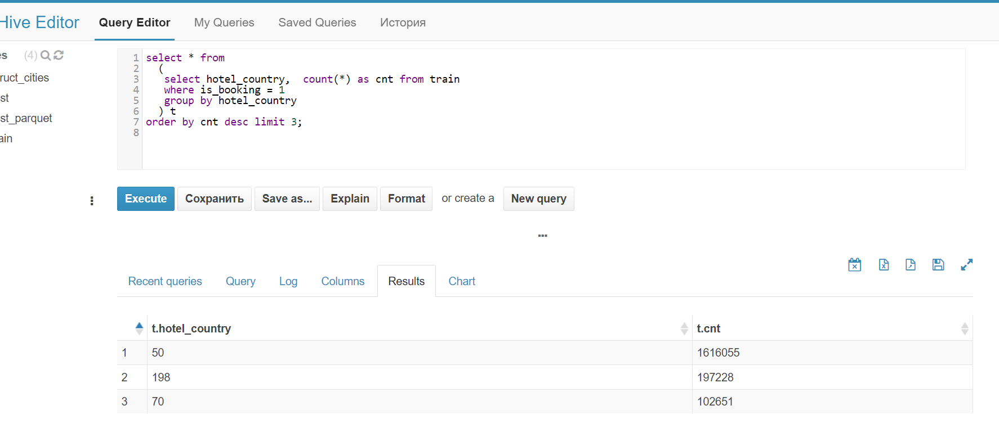


# Task 2

>Write hive script to calculate the longest period of stay of couples with children, make screenshots before and after script execution, copy hive script to archive

```
select max (datediff(srch_co, srch_ci)) as max_days_steyed
from train
where srch_children_cnt > 0;
```


# Task 3 

> Write hive script to calculate top 3 most popular hotels (treat hotel as composite key of continent, country and market) which were not booked. Most popular means most searches in dataset. Not booked means column booked = 0, make screenshots before and after script execution, copy hive script to archive.


Result (Hive):

```
select * from
  (
   select hotel_continent, hotel_country, hotel_market,  count(*) as cnt from train 
   where is_booking = 1
   group by hotel_continent, hotel_country, hotel_market
  ) t
order by cnt desc limit 3;
```
Impala:

```
select hotel_continent, hotel_country, hotel_market,  count(*) as cnt from train 
where is_booking = 1
group by hotel_continent, hotel_country, hotel_market
order by count(*) desc limit 3;
```


Result (Hive):
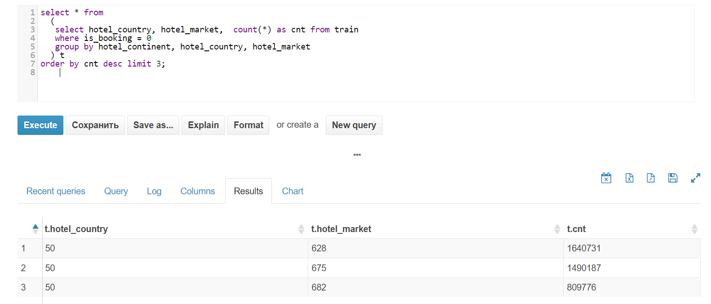
Result (Impala):
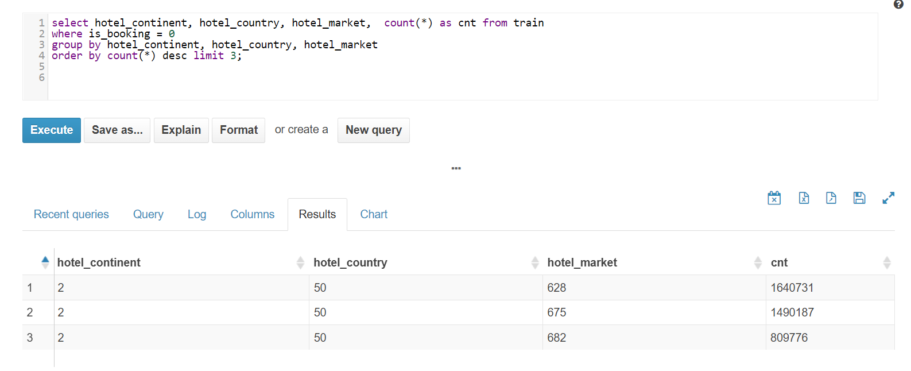


# Task 5


>Create table using LATERAL VIEW explode() from struct_cities.csv and execute query which returns amount of potential tourists (searches) for available cities in 2015,2016,2017 in every country. In cases when there are more than 1 available city for 1 year, divide searches equally. Compare execution plans and time for unclustered and clustered version of the table `train`. Make screenshots of executions, add scripts and screenshots to archive


Let's get count of cities for each year for all countries: 

```
create or replace view available_cities as
  select country_code, year, count(*) as cities_count from
    (select    country_code 
             , 2017 as year
     from struct_cities 
     lateral view explode (cities.available_2017) a17 as available_2017
     where  available_2017 = 'TRUE'
 
     union all
 
     select    country_code 
            , 2016 as year
     from struct_cities 
     lateral view explode (cities.available_2016) a16 as available_2016
     where  available_2016 = 'TRUE'
 
     union all
 
     select    country_code 
             , 2015 as year
     from struct_cities 
     lateral view explode (cities.available_2015) a15 as available_2015
     where  available_2015 = 'TRUE'
     ) city_year
  group by country_code, year
;

```


Get count of people who searched hotels in a country (group by year of potential check-in). 
```
create or replace view interested_tourists as
  select hotel_country, YEAR(srch_ci) as year, count(*) as tourists_count  
  from train t
  where YEAR(srch_ci) in (2015, 2016, 2017)    
  group by hotel_country, YEAR(srch_ci);

```
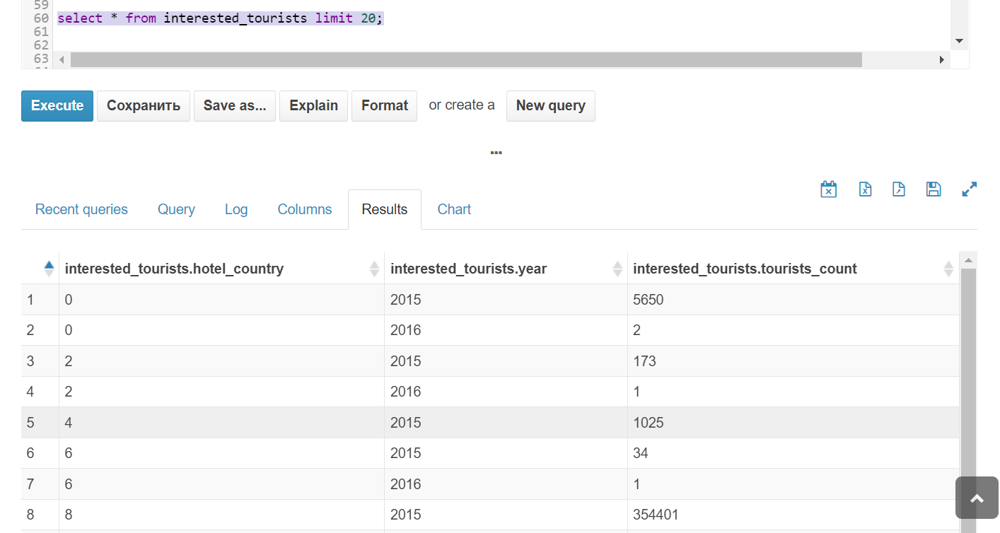

Finally:
```
select it.hotel_country
     , it.year
     , it.tourists_count
     , ac.cities_count
     , it.tourists_count / ac.cities_count as potential_tourists -- divide searches equally 
from interested_tourists it
 join available_cities ac
         on it.hotel_country = ac.country_code and
            it.year = ac.year;

```
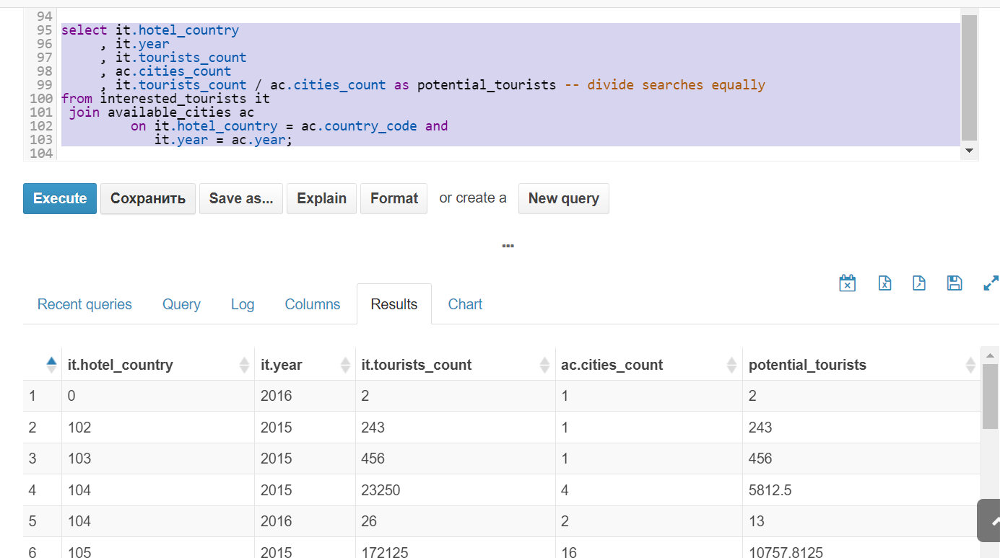