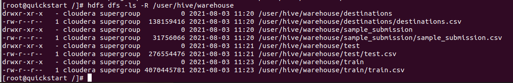

# make dirs at hdfs
```
$ hdfs dfs -mkdir -p /user/hive/warehouse/destinations
$ hdfs dfs -mkdir -p /user/hive/warehouse/sample_submission
$ hdfs dfs -mkdir -p /user/hive/warehouse/test
$ hdfs dfs -mkdir -p /user/hive/warehouse/train
```


# put files to hdfs 
```
$hdfs dfs -put -f destinations.csv /user/hive/warehouse/destinations/destinations.csv ;  hdfs dfs -put -f sample_submission.csv /user/hive/warehouse/sample_submission/sample_submission.csv ;  hdfs dfs -put -f test.csv  /user/hive/warehouse/test/test.csv ; hdfs dfs -put  -f train.csv /user/hive/warehouse/train/train.csv
```
# result




Task_2\screenshots\hue - file browser.png


