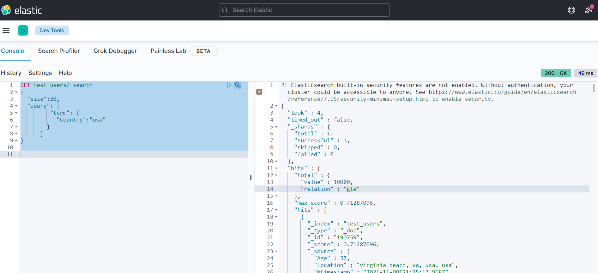

# Task L1:
Using previous example and Logstash guide from https://www.elastic.co/guide/en/logstash/ create config, which load data from file BX-Users.csv to the "test_users“ index. Drop “Age” NULL values from logstash event using remove_field option for csv filter. Parse “Location” into “State”, “City” and “Country” fields using grok or dissect plugin. 
Create proper index-pattern and check whether data has been loaded correctly in the index.
As the answer – provide link to a file, provide printscr of Kibana Discovery with data from the “test_users” index.

## Result:

[_elk/logstash_configs/pipelines/csv_users.cfg](_elk/logstash_configs/pipelines/csv_users.cfg)


___

# Task Q1
Get 20 documents from “test_rating” index, where field country =“usa”. Use “term” in the filter.

## Result

``` 
GET test_rating/_search
{  
  "size":20,
  "query": {
         "term": {
           "Country":"usa"
        }
      }
}
```

Result of query: [./query_results/Q1.json](./query_results/Q1.json)

__Note__: “Age” is needed in next tasks, so the field is not excluded


# Task A1
Get average age for users from Sweden (use index test_users). We can filter documents before aggregating using “query” + “agg” clause. Or we just can filter during aggregating using sibling aggregation 
agg:{ 
   country_ag{}
, agg:{av_age{}}
} 


## Result

```
GET test_users/_search
{
  "size": 0,
    "query": {
         "term": {
           "Country":"sweden"
        }
      },
  "aggs": {
    "avg_age": {
      "avg": {
        "field": "Age"
      }
    }
  }
}
```


# Task A2
Get average age of the users grouping by countries and cities.
As the answer – provide link to a file with  4 (Q1,A1,A2) elasticsearch query.

```
GET test_users/_search
{
  "size":0,
  "aggs": {
    "countries": {
      "terms": {
        "field": "Country.keyword"
      },  
      "aggs": {
        "avg_age": {
          "avg": {
            "field": "Age"
          }
        }
      }
    }
  }
}
```


# Task K1
Create a visualization with average age for users grouping by counties and cities (as in task A2) using any type of view.
As the answer a print screen should be provided.
